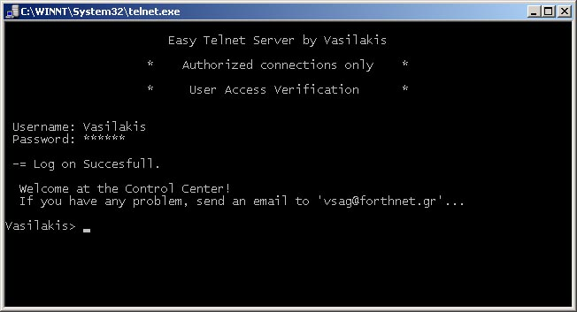



## A Telnet Server

### Description

A Telnet Server MULTI-Client! Many features ready! Easy to change/add your commands/help etc! User access verification and more! Adduser/Deluser from telnet commands, who, userlist and many other features. Great Telnet Environment! A must for every Telnet Server Programmer/Developer.
 
### More Info
 
This is an advanced telnet server and packet filtering. Please do not harm it, or else i am not responsible for its actions... Thanks!

             |
---                |---
**Submitted On**   |2000-06-24 09:20:30
**By**             |[vasilakis](https://github.com/Planet-Source-Code/PSCIndex/blob/master/ByAuthor/vasilakis.md)
**Level**          |Advanced
**User Rating**    |4.7 (70 globes from 15 users)
**Compatibility**  |VB 5\.0, VB 6\.0
**Category**       |[Internet/ HTML](https://github.com/Planet-Source-Code/PSCIndex/blob/master/ByCategory/internet-html__1-34.md)
**World**          |[Visual Basic](https://github.com/Planet-Source-Code/PSCIndex/blob/master/ByWorld/visual-basic.md)
**Archive File**   |[CODE\_UPLOAD70736242000\.zip](https://github.com/Planet-Source-Code/vasilakis-a-telnet-server__1-9199/archive/master.zip)

### API Declarations

Not many :)

